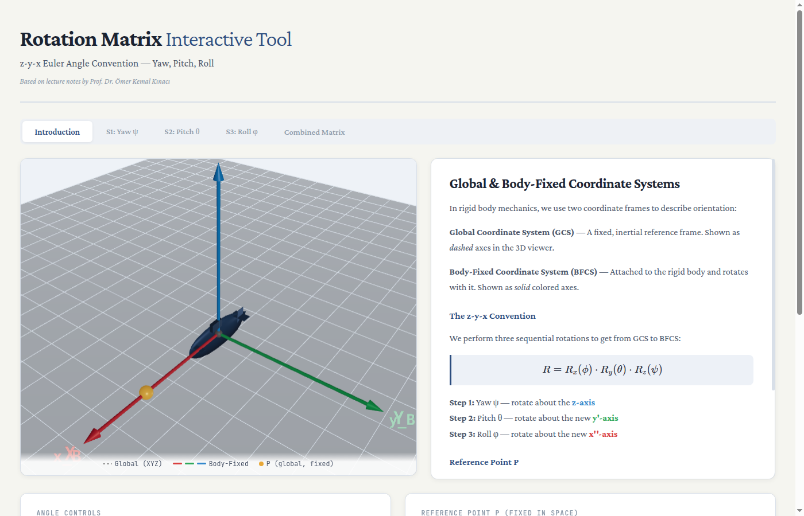

# Rotation Matrix Interactive Tool

An interactive single-page web app to learn 3D rotation matrices using **yaw (psi), pitch (theta), and roll (phi)**.

The page combines:
- step-by-step theory panels,
- live matrix equations,
- a 3D viewer built with Three.js,
- and coordinate transformation output for a reference point.

## Course Information

- Course Code: `DEN 462E`
- Course Title (TR): `Deniz araçlarının hareketleri ve kontrolü`
- Course Title (EN): `Motions&Control of Mar.Vehic.`
- Class Instructor: `Prof. Dr. Ömer Kemal Kınacı`

## Purpose

This project was prepared to support learning by making abstract motion and rotation topics more interactive and visual.

It was also developed as a personal learning tool to better understand the subject through hands-on exploration.

## Screenshot



## Features

- Interactive sliders for `psi`, `theta`, and `phi`
- Real-time matrix updates (`Rz`, `Ry`, `Rx`, and combined rotation)
- 3D coordinate frame visualization
- Reference point transformation between global and rotated coordinates
- Gimbal lock warning when pitch is near ±90°

## Tech Stack

- HTML5
- CSS3
- Vanilla JavaScript (ES modules)
- [Three.js](https://threejs.org/)
- [KaTeX](https://katex.org/) for equation rendering

## Run Locally

No build step is required.

1. Clone the repository
2. Open `rotation-matrix-interactive.html` in your browser

For local development with a static server, for example:

```bash
python3 -m http.server 8080
```

Then visit `http://localhost:8080`.

## Project Structure

- `rotation-matrix-interactive.html`: app layout, styles, and logic
- `submarine-no-clip.png`: visual asset used by the project

## Notes

The app loads third-party libraries from CDN.
